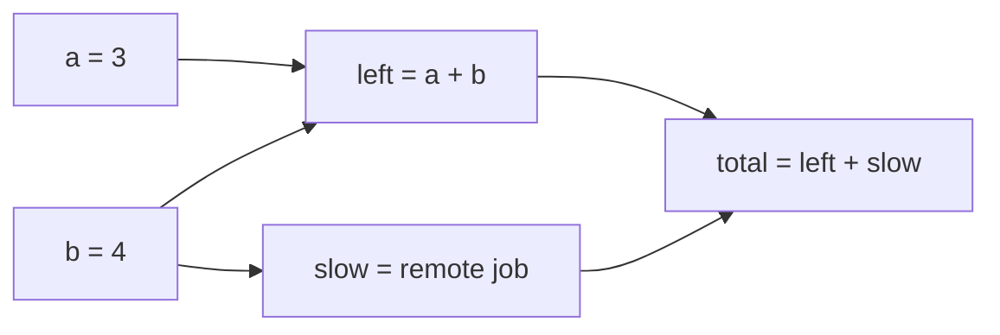

# suspendable-http example

A runnable end-to-end demo of `SuspendableDagVisitor`: a little http4s server that runs a
DAG, suspends it to a JSON file on disk when a node kicks off a "remote job", and resumes
it when the job's result is posted back — the webhook flow from
`docs/2026-08-21-suspendable-dag-runner.md`, with the filesystem standing in for the
database and you standing in for the remote service.

The DAG it runs:



`a`, `b`, and `left` complete immediately; `slow` suspends with a fresh job handle, which
blocks `total`, so the run is written to `./data/runs/<runId>.json` and the server tells
you what it's waiting on.

## Walkthrough

```console
$ sbt exampleSuspendableHttp/run
```

Start a run:

```console
$ curl -s -X POST localhost:8080/runs
{"runId":"e112c727-...","status":"suspended","waitingOn":[{"node":"slow","handle":"job-535855f0-..."}],"snapshot":{...}}
```

At this point you can restart the server — the run only exists on disk now, which is the
whole point. Then play the remote service and deliver the job's result:

```console
$ curl -s -X POST localhost:8080/jobs/job-535855f0-.../complete -d '{"result": 8}'
{"runId":"e112c727-...","status":"finished","outputs":{"a":3,"b":4,"left":7,"slow":8,"total":15}}
```

The server rehydrated the snapshot from disk, resumed `slow` with your payload, ran
`total`, and saved the finished result. Inspect any run at any point with:

```console
$ curl -s localhost:8080/runs/<runId>
```

## What to look at in the code

Everything is in one file, `SuspendableHttpExample.scala`:

* the **visitor** — `Constant`/`Sum` complete in `run`; `RemoteJob` suspends in `run` and
  completes in `resume`, showing the submit-half / collect-half split
* the **store** — one JSON file per run via the `DagSnapshotCodecs` from
  `hedgehogs-dag-visitor-circe`; `findWaiting` is the `wait_handles` index from the design
  doc, done as a scan because it's a demo
* the **write lock** — a single global `Semaphore` standing in for the database's
  single-writer-per-run guarantee (a real app would CAS on a revision column instead)
